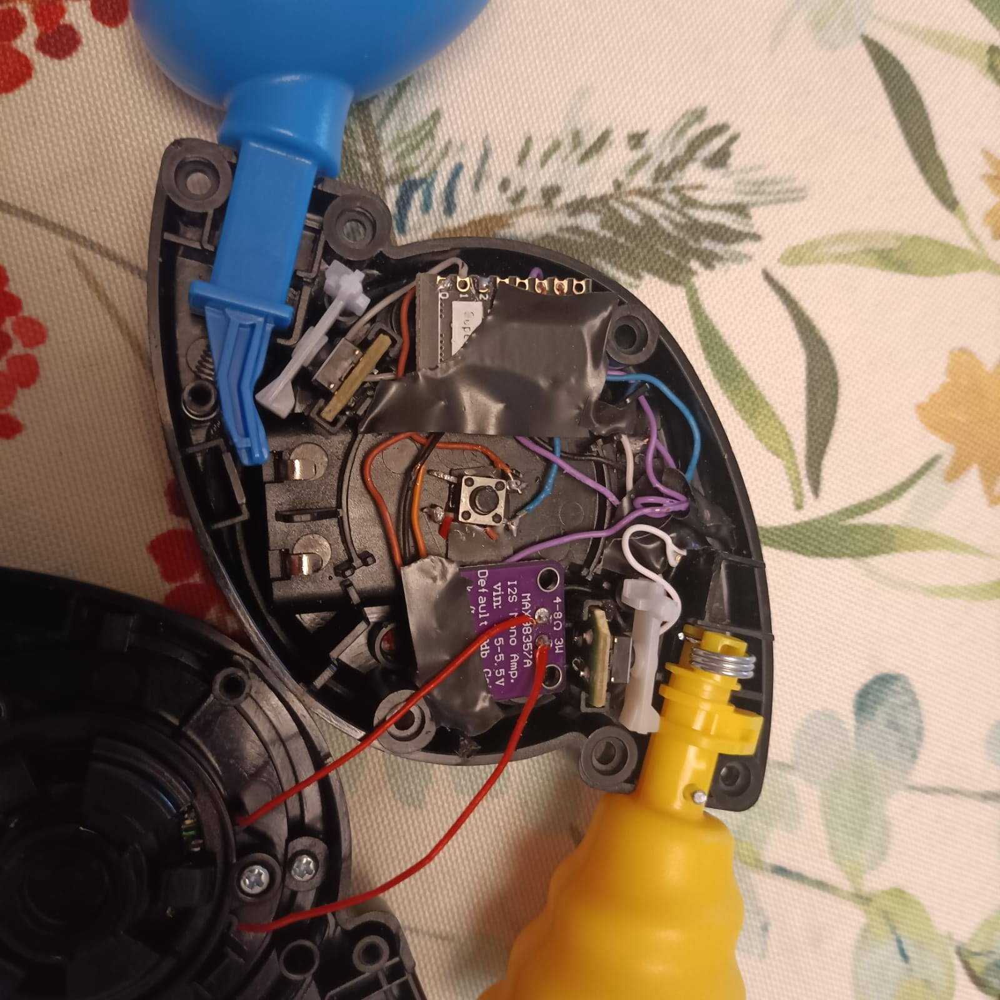

# Whack It!

A modified Bop It Micro, equipped with an ESP32 microcontroller and an I2S amplifier, allowing for custom code and audio output for interactive applications.

## Hardware required

- ESP32 C3 Super Mini 
- MAX98357a I2S amplifier
- Bop It Micro

## Comments

The hardest part is to make everything fit inside the Bop It Micro case. I had to remove some of the plastic inside the case to make space for the ESP32 and the amplifier. 

### Thanks
Thank you [Stappung](https://github.com/Stappung) for all the patience and help with this project.
